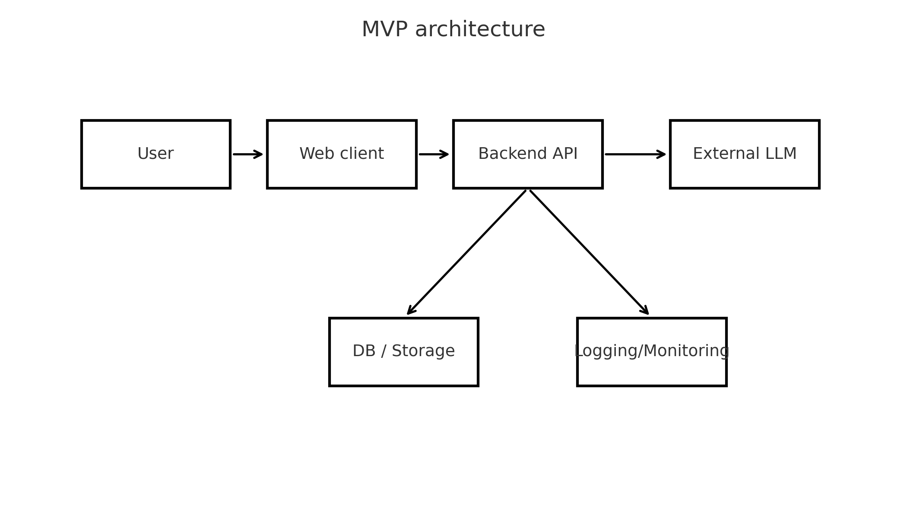
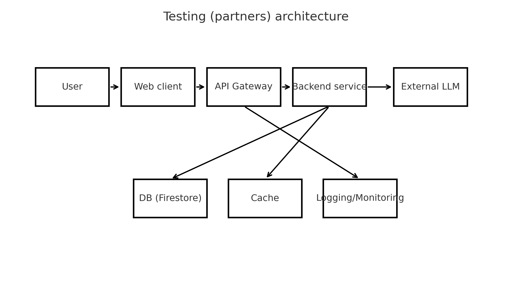
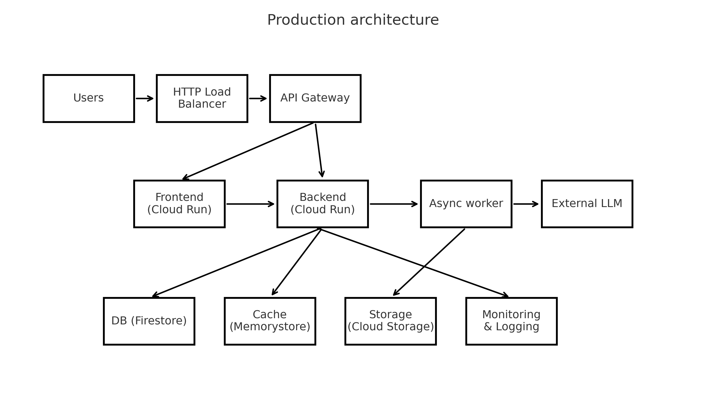

University: ITMO University  
Faculty: FICT  
Course: Cloud platforms as the basis of technology entrepreneurship  
Year: 2025  
Group: U4225  
Author: Иванов Никита  
Lab: Lab4  
Date of create: 05.12.2025  
Date of finished: 05.12.2025  

# Лабораторная работа №4 — Разработка инфраструктуры MVP AI приложения

## Цель работы

Спроектировать инфраструктуру AI-приложения для трёх стадий развития (MVP, тестирование партнёрами и продовая версия), подобрать подходящие облачные ресурсы Google Cloud, оценить примерную стоимость и обосновать выбранные архитектурные решения.

## Описание приложения

В качестве примера рассматривается веб-сервис **StudyHelper** — AI-помощник для студентов.

Пользователь заходит на сайт, задаёт текстовый вопрос (по учёбе, конспектам, задачам), а сервис отправляет запрос в облачную AI-модель и возвращает ответ в виде текста.

Основные функции:

- веб-интерфейс с формой ввода и отображением истории диалога;
- backend-API (`/chat`) для приёма запросов и вызова AI-модели;
- интеграция с облачной LLM (Vertex AI или аналог);
- логирование запросов/ответов;
- хранение истории диалогов и минимальной информации о пользователях.

---

## Ход работы

### Оценка нагрузки

| Стадия                  | Активных пользователей в день | Запросов к API в месяц (оценка) |
|-------------------------|-------------------------------|----------------------------------|
| Шаг 1 — MVP             | до 50                        | ~3 000                           |
| Шаг 2 — Тестирование    | до 300                       | ~60 000                          |
| Шаг 3 — Прод            | 1 000+                       | 300 000+                         |

---

## Шаг 1 — MVP

### Виртуализированная схема

На стадии MVP задача — показать рабочий прототип минимальной группе пользователей при минимальных затратах. Максимально упрощаем архитектуру и опираемся на serverless-сервисы.

**Выбранные компоненты:**

- **User** — браузер пользователя.  
- **Web client** — простая страница с формой ввода (отдаётся тем же сервисом, что и backend).  
- **Backend API** — обработка HTTP-запросов, вызов AI-модели.  
- **External LLM** — облачная модель (Vertex AI / аналог).  
- **DB / Storage** — базовое хранилище истории (Firestore / Cloud Storage).  
- **Logging/Monitoring** — Cloud Logging / Cloud Monitoring.

**Соответствие сервисам GCP (MVP):**

- Web client + Backend API → **Cloud Run** (1 минимальный сервис).  
- External LLM → **Vertex AI** (text/chat model).  
- DB / Storage → **Firestore** или **Cloud Storage**.  
- Logging/Monitoring → **Cloud Logging / Cloud Monitoring**.

**Схема инфраструктуры (MVP):**

### Оценка стоимости (MVP)

При объёме ~3 000 запросов в месяц:

- Cloud Run — укладывается в бесплатный уровень, ≈ 0–2 $/мес.  
- Vertex AI — при небольшой длине запросов/ответов: **1–5 $/мес**.  
- Firestore / Storage — при малом объёме данных — в пределах free tier.  
- Логирование — в бесплатных квотах.

**Итого для MVP:** ориентировочно **3–10 $ в месяц**.

---

## Шаг 2 — Тестирование с партнёрами

На этом этапе продукт тестируют внешние пользователи (партнёры, пилотные команды). Требуются более стабильная работа и аккуратное хранение данных.

### Виртуализированная схема

**Новые компоненты и изменения:**

- Добавляется **API Gateway** для централизованного входа в API.  
- Backend масштабируется до нескольких инстансов Cloud Run.  
- Появляется **Cache** для снижения количества обращений к LLM и БД.  
- Укрепляются **Logging/Monitoring** для анализа поведения пользователей.

**Состав:**

- User → Web client → API Gateway → Backend service → External LLM.  
- Backend пишет данные в **DB (Firestore)**, часть ответов может кешироваться в **Cache**.  
- API Gateway отправляет технические метрики в **Logging/Monitoring**.

**Соответствие сервисам GCP:**

- Web client → Cloud Run / статический хостинг на Cloud Storage + Cloud CDN.  
- API Gateway → **API Gateway / Cloud Endpoints**.  
- Backend service → **Cloud Run** (2–3 инстанса).  
- External LLM → **Vertex AI**.  
- DB → **Firestore**.  
- Cache → **Memorystore (Redis)** или in-memory cache.  
- Logging/Monitoring → **Cloud Logging / Cloud Monitoring**.

**Схема инфраструктуры (Testing):**

### Оценка стоимости (тестирование)

При ~60 000 запросов в месяц:

- Cloud Run (несколько инстансов) — **5–15 $/мес**.  
- Vertex AI — порядок **20–40 $/мес**.  
- Firestore — 1–5 $/мес (операции чтения/записи + немного хранилища).  
- Cache / API Gateway / Monitoring — ещё **5–10 $/мес**.

**Итого:** ориентировочно **30–70 $ в месяц** для стадии тестирования.

---

## Шаг 3 — Продовая версия

На продовой стадии ожидается рост нагрузки и возможная монетизация. Появляются требования по отказоустойчивости, SLA, контролю затрат и наблюдаемости.

### Виртуализированная схема

**Дополнительно к этапу тестирования:**

- Перед API Gateway добавляется **HTTP Load Balancer**.  
- Frontend и Backend разделены на разные сервисы Cloud Run.  
- Вводится отдельный **Async worker** для асинхронных задач (обработка тяжёлых запросов к LLM, генерация отчётов и пр.).  
- Появляется отдельное долговременное **Storage** для логов и бэкапов.

**Состав:**

- Users → HTTP Load Balancer → API Gateway.  
- Далее трафик распределяется на **Frontend (Cloud Run)** и **Backend (Cloud Run)**.  
- Backend обращается к:
  - **DB (Firestore)** — основное хранилище данных;
  - **Cache (Memorystore)** — кеширование частых запросов;
  - **Async worker** — отложенная обработка тяжёлых задач.  
- Async worker взаимодействует с **External LLM** и сохраняет результаты в **Storage (Cloud Storage)**.  
- Все компоненты отправляют метрики и логи в **Monitoring & Logging**.

**Соответствие сервисам GCP:**

- HTTP Load Balancer → **Cloud HTTP(S) Load Balancing**.  
- API Gateway → **API Gateway / Cloud Endpoints**.  
- Frontend / Backend / Async worker → **Cloud Run** (разные сервисы).  
- External LLM → **Vertex AI**.  
- DB → **Firestore** (+ возможный BigQuery для аналитики).  
- Cache → **Memorystore (Redis)**.  
- Storage → **Cloud Storage**.  
- Monitoring & Logging → **Cloud Logging / Cloud Monitoring (+ Alerting)**.

**Схема инфраструктуры (Production):**

### Оценка стоимости (продовая версия)

При ~300 000 запросов в месяц:

- Cloud Run (несколько сервисов, прод-нагрузка) — **20–60 $/мес**.  
- Vertex AI — основная статья затрат: порядка **100–250 $/мес**, в зависимости от выбранной модели и длины промптов.  
- Firestore + Storage + Cache — **10–40 $/мес**.  
- Наблюдаемость (логирование, алерты, хранение логов) — **10–30 $/мес**.

**Итого:** ориентировочно **150–350 $ в месяц** для продовой инфраструктуры.

---

## Обоснование выбора ресурсов

1. **Serverless-подход (Cloud Run + управляемые сервисы)**  
   - Минимальные операционные затраты.  
   - Автоматическое масштабирование и масштабирование до нуля на ранних стадиях.  
   - Возможность плавно увеличивать ресурсы при росте нагрузки, не переписывая приложение.

2. **Использование управляемой AI-платформы (Vertex AI)**  
   - Отсутствие затрат на поддержку собственного ML-стека.  
   - Оплата по факту использования (количество токенов/запросов).  
   - Лёгкая смена моделей в будущем без изменения общей архитектуры.

3. **Firestore как основная база данных**  
   - Документная модель хорошо подходит для хранения диалогов и пользовательских сессий.  
   - Автоматическое масштабирование и наличие бесплатного уровня.

4. **Постепенное усложнение архитектуры**  
   - На **MVP** — минимальный набор (Cloud Run + Vertex AI + простое хранилище).  
   - На **тестировании** — добавление API Gateway, кеша и более серьёзной БД.  
   - На **проде** — разделение сервисов, async-обработка, отдельный Storage и полноценный мониторинг.

5. **Контроль стоимости**  
   - На всех этапах основная статья расходов — вызовы AI-модели.  
   - Добавление кеша и асинхронной обработки на проде снижает количество обращений к LLM и даёт экономию.

---

## Вывод

В рамках лабораторной работы была спроектирована поэтапная инфраструктура AI-приложения StudyHelper:

- определены три стадии развития (MVP, тестирование партнёрами, продовая версия);
- для каждой стадии описаны архитектура, используемые ресурсы и экономическая оценка;
- показано, как можно начать с минимальной конфигурации и постепенно расширять её без радикальной смены стека.

Получившаяся архитектура соответствует задачам дисциплины: демонстрирует практическое использование облачных платформ для технологического предпринимательства и показывает, как балансировать между стоимостью и масштабируемостью.
